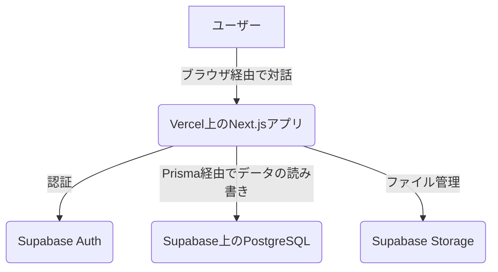

# プロジェクトアーキテクチャ概要

このドキュメントは、アプリケーションのハイレベルなアーキテクチャの概要を説明します。

## 1. システムコンテキスト図



## 2. フロントエンドアーキテクチャ

**フレームワーク**: Next.js (App Router)
**レンダリング戦略**: 静的サイト生成 (SSG) をデフォルトのアプローチとして優先し、半動的なコンテンツにはインクリメンタル静的再生成 (ISR) を、ユーザー固有のデータやリアルタイムデータが必要な場合にのみサーバーサイドレンダリング (SSR) を使用します。
**コンポーネント構造**: 機能ベースのディレクトリ構造 (src/features) と共有UIライブラリ (src/components/ui) を組み合わせています。

### レンダリング戦略の優先順位

1. **静的サイト生成 (SSG)** - デフォルトの選択

   - マーケティングページやランディングページ
   - 会社情報ページ
   - ブログ記事や記事
   - 商品カタログ
   - ドキュメントページ
   - ユーザー固有のデータを必要としないすべてのコンテンツ

2. **インクリメンタル静的再生成 (ISR)** - 半動的コンテンツ

   - ニュース記事やプレスリリース
   - 商品在庫の更新
   - 価格情報
   - 頻繁には変更されないが定期的な更新が必要なコンテンツ

3. **サーバーサイドレンダリング (SSR)** - 動的コンテンツ (控えめに使用)

   - ユーザーダッシュボードやプロファイル
   - 認証が必要なページ
   - リアルタイムデータに依存するページ
   - サーバーサイドでのセッション検証が必要なページ

4. **クライアントサイドレンダリング (CSR)** - インタラクティブなコンポーネント
   - インタラクティブなウィジェットやコンポーネント
   - リアルタイムチャットや通知
   - 複雑なフォーム操作
   - ブラウザAPIを必要とするコンポーネント

## 3. バックエンドアーキテクチャ

**ランタイム**: Next.js Server Actions および API Routes。
**データベース**: Supabase でホストされる PostgreSQL。
**ORM**: すべてのデータベース操作に Prisma を使用。
**認証**: Supabase Auth によって完全に管理されます。Supabase からの JWT を使用して、バックエンドへのリクエストを認証します。

## 4. 技術スタック

### フロントエンド

- **フレームワーク**: Next.js 16 (App Router)
- **言語**: TypeScript
- **Reactバージョン**: React 19 (最新)
- **スタイリング**: Tailwind CSS v4 (最新)
- **UIコンポーネント**: shadcn/ui, Radix UI
- **状態管理**:
  - サーバー状態: TanStack Query
  - グローバルクライアント状態: Zustand
  - ローカル状態: React Hooks
- **フォーム**: React Hook Form + Zod

### バックエンド

- **データベース**: PostgreSQL (Supabaseでホスト)
- **ORM**: Prisma
- **認証**: Supabase Auth
- **ストレージ**: Supabase Storage
- **API**: Next.js Server Actions + API Routes

### 開発とテスト

- **開発環境**:
  - **ローカル**: Node.js 直接実行 (`pnpm run dev`)
  - **Docker**: コンテナ化された環境 (`docker-compose up -d`) ポート 3003
- **テストランナー**: Vitest
- **コンポーネントテスト**: React Testing Library
- **E2Eテスト**: Playwright
- **パッケージマネージャー**: pnpm

### デプロイ

- **ホスティング**: Vercel (本番/ステージング)
- **ローカル開発**: Docker コンテナ化 (ポート 3003)
  - **Docker設定**: `Dockerfile` と `docker-compose.yml`
  - **コンテナ名**: `admin-app-dev`
  - **ポート**: 3003
  - **注意**: 本番デプロイは Vercel を使用します。Docker はローカル開発専用です。
- **データベースと認証**: Supabase
- **CI/CD**: Vercel の組み込みデプロイパイプライン

## 5. ディレクトリ構造

### プロジェクトルート構造

```
/
├── .agent/                 # AIアシスタント用設定
│   └── workflows/          # Antigravity ワークフロー定義
├── .cursor/                # Cursor IDE 設定
├── .husky/                 # Git フック設定
│   └── pre-commit          # コミット前にBiome実行
├── .vscode/                # VS Code 設定
├── apps/                   # モノレポ アプリケーション
│   └── admin/              # 管理画面アプリ (Next.js)
├── docs/                   # プロジェクトドキュメント
│   ├── er-diagram-v2.html  # ER図 (HTML形式)
│   └── er-diagram-v2.md    # ER図 (Markdown形式)
├── prisma/                 # Prisma設定 (全アプリ共有)
│   └── schema.prisma       # データベーススキーマ定義
├── biome.json              # Biome リンター/フォーマッター設定
├── compose.yml             # Docker Compose 設定
├── Dockerfile              # Docker イメージ定義
├── package.json            # ルートパッケージ設定
├── pnpm-workspace.yaml     # pnpm ワークスペース設定
├── prisma.config.ts        # Prisma 設定ファイル
├── tsconfig.json           # TypeScript 設定 (ベース)
└── vercel.json             # Vercel デプロイ設定
```

### Admin アプリ構造 (`apps/admin/`)

```
apps/admin/
├── public/                 # 静的アセット
│   ├── logo_b.svg          # ロゴ (黒)
│   ├── logo_w.svg          # ロゴ (白)
│   └── *.svg               # その他アイコン
├── src/
│   ├── app/                # Next.js App Router
│   ├── components/         # UIコンポーネント
│   ├── config/             # アプリ設定
│   ├── contexts/           # React Context
│   ├── data/               # 静的データ/モックデータ
│   ├── features/           # 機能別モジュール
│   ├── hooks/              # 共有カスタムフック
│   ├── lib/                # ユーティリティライブラリ
│   ├── schemas/            # Zod バリデーションスキーマ
│   ├── server/             # サーバーサイドロジック
│   ├── services/           # 外部サービス連携
│   ├── stores/             # Zustand ストア
│   ├── types/              # TypeScript 型定義
│   └── utils/              # ユーティリティ関数
├── components.json         # shadcn/ui 設定
├── next.config.ts          # Next.js 設定
├── package.json            # アプリ依存関係
├── vitest.config.ts        # Vitest テスト設定
└── vitest.setup.ts         # テストセットアップ
```

### App Router 構造 (`apps/admin/src/app/`)

```
app/
├── (auth)/                 # 認証ルートグループ (レイアウト共有)
│   ├── layout.tsx          # 認証ページ用レイアウト
│   ├── login/              # ログインページ
│   │   └── page.tsx
│   └── logout/             # ログアウト処理
│       └── page.tsx
├── (protected)/            # 保護されたルートグループ
│   ├── layout.tsx          # サイドバー付きレイアウト
│   ├── ProtectedLayoutClient.tsx
│   ├── page.tsx            # ダッシュボードホーム
│   ├── dashboard/          # ダッシュボード詳細
│   ├── members/            # 会員管理
│   ├── properties/         # 物件管理
│   ├── realtors/           # 不動産業者管理
│   ├── realtor-replies/    # 業者返信管理
│   ├── user-posts/         # ユーザー投稿管理
│   ├── inquiry-management/ # 問い合わせ管理
│   ├── property-inquiries/ # 物件問い合わせ
│   ├── realtor-inquiries/  # 業者問い合わせ
│   ├── site-inquiries/     # サイト問い合わせ
│   ├── bulk-assessment/    # 一括査定
│   ├── bulk-assessments/   # 一括査定一覧
│   ├── content/            # コンテンツ管理
│   ├── file-box/           # ファイルボックス
│   ├── mail/               # メール管理
│   └── settings/           # システム設定
├── api/                    # API ルート
│   ├── auth/               # 認証API
│   │   ├── callback/       # OAuth コールバック
│   │   └── signout/        # サインアウト
│   └── trpc/               # tRPC エンドポイント
│       └── [trpc]/
├── login-info/             # ログイン情報ページ
├── globals.css             # グローバルスタイル
├── layout.tsx              # ルートレイアウト
├── page.tsx                # ルートページ (リダイレクト)
├── providers.tsx           # プロバイダー設定
├── error.tsx               # エラーページ
└── not-found.tsx           # 404ページ
```

### Components 構造 (`apps/admin/src/components/`)

```
components/
├── admin/                  # 管理画面専用コンポーネント
│   ├── content-management/ # コンテンツ管理
│   ├── inquiry-management/ # 問い合わせ管理
│   ├── system-settings/    # システム設定
│   ├── user-management/    # ユーザー管理
│   └── index.ts            # エクスポート
├── common/                 # 共通コンポーネント
│   ├── ConfirmDialog.tsx   # 確認ダイアログ
│   ├── ErrorDisplay.tsx    # エラー表示
│   ├── LoadingSpinner.tsx  # ローディング
│   ├── ModalComponents.tsx # モーダル
│   ├── NotFoundDisplay.tsx # 404表示
│   ├── RedirectHandler.tsx # リダイレクト処理
│   └── TableSection.tsx    # テーブルセクション
├── layout/                 # レイアウトコンポーネント
│   ├── AccountForm.tsx     # アカウントフォーム
│   ├── AppSidebar.tsx      # サイドバー
│   ├── NavUser.tsx         # ユーザーナビ
│   └── SiteHeader.tsx      # ヘッダー
├── property-details/       # 物件詳細コンポーネント
├── property-forms/         # 物件フォーム
├── providers/              # プロバイダー
├── settings/               # 設定コンポーネント
├── table-columns/          # テーブルカラム定義
├── tables/                 # テーブルコンポーネント
│   ├── DataTable.tsx       # 基本データテーブル
│   ├── GenericDataTable.tsx# 汎用データテーブル
│   └── TableToolbar.tsx    # ツールバー
└── ui/                     # shadcn/ui コンポーネント (47+)
    ├── accordion.tsx
    ├── alert-dialog.tsx
    ├── button.tsx
    ├── calendar.tsx
    ├── card.tsx
    ├── checkbox.tsx
    ├── command.tsx
    ├── dialog.tsx
    ├── dropdown-menu.tsx
    ├── form.tsx
    ├── input.tsx
    ├── label.tsx
    ├── pagination.tsx
    ├── popover.tsx
    ├── select.tsx
    ├── sidebar.tsx
    ├── table.tsx
    ├── tabs.tsx
    ├── textarea.tsx
    ├── tooltip.tsx
    └── ...                 # その他UIプリミティブ
```

### Server 構造 (`apps/admin/src/server/`)

```
server/
├── api/                    # tRPC API 設定
│   ├── root.ts             # tRPC ルーター統合
│   ├── trpc.ts             # tRPC 基本設定
│   └── routers/            # 機能別ルーター
│       └── *.ts
└── dal/                    # Data Access Layer
    └── search.ts           # 検索クエリ
```

### その他の主要ディレクトリ

```
lib/                        # ライブラリ設定
├── prisma.ts               # Prisma クライアント
├── utils.ts                # ユーティリティ
└── supabase/               # Supabase 設定
    ├── client.ts           # クライアントサイド
    └── server.ts           # サーバーサイド

features/                   # 機能モジュール
└── auth/                   # 認証機能
    ├── components/         # 認証コンポーネント
    └── hooks/              # 認証フック

hooks/                      # 共有フック
├── use-file-upload.ts      # ファイルアップロード
├── use-mobile.ts           # モバイル検出
├── useDataTable.ts         # データテーブル
├── useManagementForm.ts    # 管理フォーム
└── useRolePermissions.ts   # 権限管理

schemas/                    # Zod スキーマ
├── propertySchema.ts       # 物件スキーマ
└── realtorSchema.ts        # 不動産業者スキーマ

stores/                     # Zustand ストア
└── sidebarStore.ts         # サイドバー状態

types/                      # 型定義
├── common-props.ts         # 共通Props型
├── models.ts               # モデル型
├── role.ts                 # ロール型
└── search.ts               # 検索型

config/                     # アプリ設定
└── nav.ts                  # ナビゲーション設定

contexts/                   # React Context
└── PageTitleContext.tsx    # ページタイトル

data/                       # 静的データ
└── inquiry-data.ts         # 問い合わせデータ

services/                   # 外部サービス
├── search-options.json     # 検索オプション
└── searchDataService.ts    # 検索サービス

utils/                      # ユーティリティ
└── api.ts                  # API ヘルパー
```

## 6. データフロー

### 認証フロー

1. ユーザーがログイン/サインアップフォームを操作
2. クライアントサイドコード経由で認証情報を Supabase Auth に送信
3. Supabase が JWT トークンとユーザーセッションを返す
4. セッションをブラウザの Cookie/localStorage に保存
5. Server Actions がデータベース操作の前にセッションを検証

### データアクセスパターン

1. フロントエンドコンポーネントがデータ取得に TanStack Query を使用
2. TanStack Query が Server Actions または API ルートを呼び出し
3. Server Actions が Supabase でユーザーセッションを検証
4. 検証されたリクエストが Prisma Client を使用して PostgreSQL にクエリを実行
5. データがチェーンを通じてコンポーネントに戻される

### 状態管理戦略

- **サーバー状態**: TanStack Query によってキャッシュおよび管理
- **グローバルクライアント状態**: Zustand ストアによって管理
- **ローカルコンポーネント状態**: React hooks によって管理
- **フォーム状態**: React Hook Form によって管理

## 7. セキュリティに関する考慮事項

### 認証と認可

- ユーザーセッション用の Supabase Auth からの JWT トークン
- すべての保護された操作に対するサーバーサイドセッション検証
- PostgreSQL における行レベルセキュリティ (RLS) ポリシー

### データ検証

- Zod スキーマによるクライアントサイド検証
- 同じ Zod スキーマによるサーバーサイド検証
- データベースレベルでの Prisma スキーマ制約

### API セキュリティ

- Next.js の組み込みメカニズムによる CSRF 保護
- レート制限 (実装されている場合)
- 入力のサニタイズと検証
