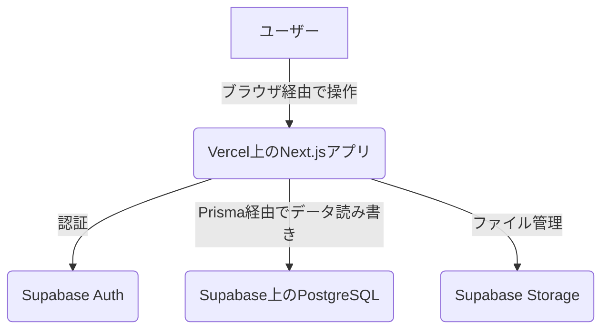

---
description:
globs:
alwaysApply: true
---
# プロジェクトアーキテクチャ概要
このドキュメントは、アプリケーションの高レベルアーキテクチャの概要を説明します。

## 1. システムコンテキスト図


## 2. フロントエンドアーキテクチャ
*   **フレームワーク**: Next.js 16 (App Router)
*   **レンダリング戦略**:
    *   動的ページにはサーバーサイドレンダリング（SSR）
    *   コンテンツページには静的サイト生成（SSG）とIncremental Static Regeneration（ISR）
    *   `cacheComponents: true` によるPartial Prerendering（PPR）で最適なパフォーマンス
*   **静的コンテンツ最適化のためのCache Components**
*   **コンポーネント構造**: 機能ベースのディレクトリ構造（`src/features`）と共有UIライブラリ（`src/components/ui`）を組み合わせています。

## 3. バックエンドアーキテクチャ
*   **ランタイム**: Next.js Server ActionsとAPIルート
*   **データベース**: Supabase上でホストされるPostgreSQL
*   **ORM**: Prismaをすべてのデータベース操作に使用
*   **認証**: Supabase Authで完全に管理。SupabaseからのJWTでバックエンドへのリクエストを認証

## 4. 技術スタック
### フロントエンド
*   **フレームワーク**: Next.js 16 (App Router)
*   **言語**: TypeScript
*   **Reactバージョン**: React 19（最新）
*   **スタイリング**: Tailwind CSS v4（最新）
*   **UIコンポーネント**: shadcn/ui, Radix UI
*   **状態管理**:
    *   サーバー状態: TanStack Query
    *   グローバルクライアント状態: Zustand
    *   ローカル状態: React Hooks
    *   フォーム: React Hook Form + Zod
*   **パフォーマンス**: Cache Components, Partial Prerendering（PPR）

### バックエンド
*   **データベース**: PostgreSQL（Supabase上でホスト）
*   **ORM**: Prisma
*   **認証**: Supabase Auth
*   **ストレージ**: Supabase Storage
*   **API**: Next.js Server Actions + APIルート

### 開発＆テスト
*   **テストランナー**: Vitest
*   **コンポーネントテスト**: React Testing Library
*   **E2Eテスト**: Playwright
*   **パッケージマネージャー**: npm/yarn/pnpm

### デプロイ
*   **ホスティング**: Vercel
*   **データベース＆認証**: Supabase
*   **CI/CD**: Vercelの組み込みデプロイパイプライン

**注記**: 将来的にback（管理画面）と統合され、単一のVercelプロジェクトとしてデプロイされます。統合時にはback側のVercel設定やGitHub Actionsを使用します。

## 5. ディレクトリ構造
```
src/
├── app/                   # Next.js App Routerページ
│   ├── (auth)/            # 認証関連ルート
│   ├── dashboard/         # 保護されたダッシュボードルート
│   └── api/               # APIルート
├── components/
│   ├── ui/                # 再利用可能なUIプリミティブ
│   └── features/          # 機能固有コンポーネント
├── features/              # 機能ベースの整理
│   └── [feature-name]/
│       ├── components/    # 機能固有コンポーネント
│       ├── hooks/         # 機能固有フック
│       └── types/         # 機能固有の型
├── lib/                   # ユーティリティライブラリ
│   ├── prisma.ts          # Prismaクライアントインスタンス
│   ├── supabase.ts        # Supabaseクライアント設定
│   └── utils.ts           # 汎用ユーティリティ
├── hooks/                 # 共有Reactフック
├── types/                 # グローバルTypeScript型
└── styles/                # グローバルスタイル
```

## 6. データフロー
### 認証フロー
1.  ユーザーがログイン/サインアップフォームを操作
2.  認証情報がクライアントサイドコード経由でSupabase Authに送信
3.  SupabaseがJWTトークンとユーザーセッションを返却
4.  セッションがブラウザのcookies/localStorageに保存
5.  Server Actionsがデータベース操作前にセッションをバリデーション

### データアクセスパターン
1.  フロントエンドコンポーネントがTanStack Queryでデータフェッチ
2.  TanStack QueryがServer ActionsまたはAPIルートを呼び出し
3.  Server ActionsがSupabaseでユーザーセッションをバリデーション
4.  バリデーション済みリクエストがPrisma ClientでPostgreSQLにクエリ
5.  データがチェーンを通じてコンポーネントに返却

### 状態管理戦略
*   **サーバー状態**: TanStack Queryでキャッシュ・管理
*   **グローバルクライアント状態**: Zustandストアで管理
*   **ローカルコンポーネント状態**: Reactフックで管理
*   **フォーム状態**: React Hook Formで管理

## 7. セキュリティ考慮事項
### 認証＆認可
*   ユーザーセッションにSupabase AuthのJWTトークンを使用
*   すべての保護された操作でサーバーサイドセッションバリデーション
*   PostgreSQLの行レベルセキュリティ（RLS）ポリシー

### データバリデーション
*   クライアントサイドでZodスキーマによるバリデーション
*   サーバーサイドでも同じZodスキーマによるバリデーション
*   データベースレベルでPrismaスキーマ制約

### APIセキュリティ
*   Next.js組み込みメカニズムによるCSRF保護
*   レート制限（実装されている場合）
*   入力のサニタイゼーションとバリデーション
