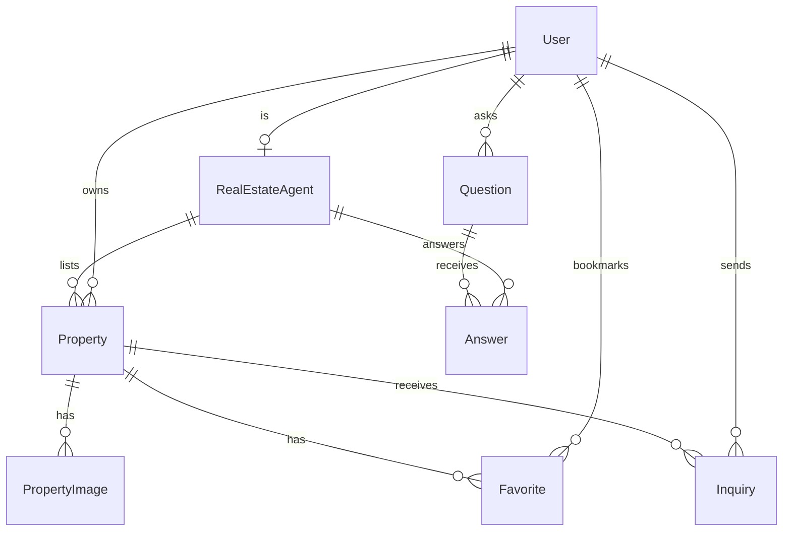

# データベーススキーマ ER図

このドキュメントは `prisma/schema.prisma` のエンティティ・リレーションシップ図（ER図）を Mermaid 形式で表現しています。

## 全体概要

```mermaid
erDiagram
    %% ============================================
    %% ユーザー管理
    %% ============================================
    User {
        string id PK
        string email UK "メールアドレス"
        string name "氏名"
        UserRole role "権限"
        UserStatus status "ステータス"
        string furigana "ふりがな"
        Gender gender "性別"
        datetime birthDate "生年月日"
        string phone "電話番号"
        string fax "FAX"
        string postalCode "郵便番号"
        string prefecture "都道府県"
        string city "市区町村"
        string address "住所"
        string companyName "会社名"
        string licenseNumber "免許番号"
        datetime createdAt
        datetime updatedAt
        datetime lastLoginAt
    }

    %% ============================================
    %% 不動産会社
    %% ============================================
    RealEstateAgent {
        string id PK
        string companyName "会社名"
        string branchName "支店名"
        string departmentName "部署名"
        string representativeName "代表者名"
        string contactPersonName "担当者名"
        string email "メール"
        string phone "電話番号"
        string fax "FAX"
        string postalCode "郵便番号"
        string prefecture "都道府県"
        string city "市区町村"
        string address "住所"
        string website "ウェブサイト"
        string businessHours "営業時間"
        string licenseNumber "免許番号"
        string associationMembership "所属協会"
        AccountType accountType "アカウント種別"
        AgentStatus status "ステータス"
        int goodCount "いいね数"
        string userId FK
        datetime createdAt
        datetime updatedAt
    }

    %% ============================================
    %% 物件
    %% ============================================
    Property {
        string id PK
        string propertyName "物件名"
        PropertyType propertyType "物件種別"
        PublicationStatus publicationStatus "公開状態"
        SaleOrRent saleOrRent "売買/賃貸"
        TransactionType transactionType "取引種別"
        PropertyCondition propertyCondition "物件状態"
        string postalCode "郵便番号"
        string prefecture "都道府県"
        string city "市区町村"
        string town "町名"
        string block "番地"
        string building "建物名"
        string nearestStation "最寄り駅"
        int walkMinutes "徒歩分"
        decimal latitude "緯度"
        decimal longitude "経度"
        string layoutNumber "間取り数"
        LayoutType layoutType "間取り"
        decimal buildingArea "建物面積"
        decimal landArea "土地面積"
        string buildingStructure "建物構造"
        datetime constructionDate "建築年月"
        decimal salePrice "販売価格"
        decimal expectedRent "想定賃料"
        PublicScope publicScope "公開範囲"
        Featured featured "おすすめ"
        int inquiryCount "問合せ数"
        int viewCount "閲覧数"
        string userId FK
        string agentId FK
        datetime createdAt
        datetime updatedAt
        datetime publishedAt
    }

    %% ============================================
    %% 物件画像
    %% ============================================
    PropertyImage {
        string id PK
        string url "画像URL"
        string caption "キャプション"
        ImageType imageType "画像種別"
        int order "表示順"
        boolean isMain "メイン画像"
        string propertyId FK
        datetime createdAt
    }

    %% ============================================
    %% 物件特徴
    %% ============================================
    PropertyFeature {
        string id PK
        string featureId FK
        string propertyId FK
    }

    FeatureMaster {
        string id PK
        string name UK "特徴名"
        FeatureCategory category "カテゴリ"
        int displayOrder "表示順"
        boolean isActive "有効"
    }

    %% ============================================
    %% お気に入り
    %% ============================================
    Favorite {
        string id PK
        string userId FK
        string propertyId FK
        datetime createdAt
    }

    %% ============================================
    %% 問い合わせ
    %% ============================================
    Inquiry {
        string id PK
        string name "氏名"
        string furigana "ふりがな"
        string email "メール"
        string phone "電話番号"
        InquiryType inquiryType "問合せ種別"
        string message "メッセージ"
        InquiryStatus status "ステータス"
        string propertyId FK
        string userId FK
        datetime createdAt
        datetime respondedAt
    }

    SiteInquiry {
        string id PK
        string name "氏名"
        string email "メール"
        string phone "電話番号"
        string inquiryType "問合せ種別"
        string inquiryContent "内容"
        InquiryStatus status "ステータス"
        datetime createdAt
        datetime respondedAt
    }

    AgentInquiry {
        string id PK
        string companyName "会社名"
        string contactPerson "担当者名"
        string email "メール"
        string phone "電話番号"
        string inquiryType "問合せ種別"
        string inquiryContent "内容"
        InquiryStatus status "ステータス"
        string agentId FK
        datetime createdAt
        datetime respondedAt
    }

    %% ============================================
    %% 一括査定
    %% ============================================
    BulkAssessment {
        string id PK
        string propertyAddress "物件住所"
        string propertyType "物件種別"
        string area "面積"
        string ownerName "所有者名"
        string email "メール"
        string phone "電話番号"
        AssessmentStatus status "ステータス"
        datetime createdAt
        datetime completedAt
    }

    %% ============================================
    %% 質問・回答
    %% ============================================
    Question {
        string id PK
        string title "タイトル"
        string content "内容"
        string category "カテゴリ"
        int viewCount "閲覧数"
        int replyCount "回答数"
        QuestionStatus status "ステータス"
        string authorId FK
        datetime createdAt
        datetime updatedAt
    }

    Answer {
        string id PK
        string content "回答内容"
        int goodCount "いいね数"
        string questionId FK
        string authorId FK
        string agentId FK
        datetime createdAt
        datetime updatedAt
    }

    QuestionCategory {
        string id PK
        string name UK "カテゴリ名"
        QuestionCategoryType categoryType "種別"
        int displayOrder "表示順"
        boolean isActive "有効"
    }

    %% ============================================
    %% マスタテーブル
    %% ============================================
    AreaMaster {
        string id PK
        string prefecture "都道府県"
        string city "市区町村"
        int displayOrder "表示順"
        boolean isActive "有効"
    }

    PropertyTypeMaster {
        string id PK
        string name UK "物件種別名"
        int displayOrder "表示順"
        boolean isActive "有効"
    }

    PropertyCategoryMaster {
        string id PK
        string name UK "カテゴリ名"
        int displayOrder "表示順"
        boolean isActive "有効"
    }

    FloorPlanMaster {
        string id PK
        string name UK "間取り名"
        int displayOrder "表示順"
        boolean isActive "有効"
    }

    RouteMaster {
        string id PK
        string name UK "路線名"
        string code UK "路線コード"
        string company "運営会社"
        int displayOrder "表示順"
        boolean isActive "有効"
    }

    Station {
        string id PK
        string name "駅名"
        string code "駅コード"
        string prefecture "都道府県"
        string city "市区町村"
        int displayOrder "表示順"
        boolean isActive "有効"
        string routeId FK
    }

    RegionMaster {
        string id PK
        string name UK "地域名"
        string code UK "地域コード"
        int displayOrder "表示順"
        boolean isActive "有効"
    }

    %% ============================================
    %% メール・ファイル・システム
    %% ============================================
    Mail {
        string id PK
        string fromEmail "送信元"
        string toEmail "送信先"
        string ccEmail "CC"
        string bccEmail "BCC"
        string subject "件名"
        string body "本文"
        MailStatus status "ステータス"
        MailType mailType "メール種別"
        datetime createdAt
        datetime sentAt
    }

    FileBox {
        string id PK
        string fileName "ファイル名"
        string originalName "元ファイル名"
        string fileUrl "ファイルURL"
        string fileType "ファイル種別"
        int fileSize "サイズ"
        string category "カテゴリ"
        datetime createdAt
        datetime updatedAt
    }

    SystemSetting {
        string id PK
        string key UK "設定キー"
        string value "設定値"
        string description "説明"
        datetime createdAt
        datetime updatedAt
    }

    %% ============================================
    %% リレーションシップ
    %% ============================================
    
    %% User関連
    User ||--o| RealEstateAgent : "has"
    User ||--o{ Property : "owns"
    User ||--o{ Inquiry : "makes"
    User ||--o{ Favorite : "has"
    User ||--o{ Question : "asks"
    User ||--o{ Answer : "writes"

    %% RealEstateAgent関連
    RealEstateAgent ||--o{ Property : "manages"
    RealEstateAgent ||--o{ Answer : "provides"
    RealEstateAgent ||--o{ AgentInquiry : "receives"

    %% Property関連
    Property ||--o{ PropertyImage : "has"
    Property ||--o{ PropertyFeature : "has"
    Property ||--o{ Inquiry : "receives"
    Property ||--o{ Favorite : "has"

    %% PropertyFeature - FeatureMaster
    PropertyFeature }o--|| FeatureMaster : "references"

    %% Question - Answer
    Question ||--o{ Answer : "has"

    %% RouteMaster - Station
    RouteMaster ||--o{ Station : "has"
```

## 主要エンティティの説明

### ユーザー管理
| エンティティ | 説明 |
|-------------|------|
| **User** | システムのユーザー（一般ユーザー、不動産業者、管理者） |
| **RealEstateAgent** | 不動産会社・業者の詳細情報 |

### 物件管理
| エンティティ | 説明 |
|-------------|------|
| **Property** | 物件情報（メインエンティティ） |
| **PropertyImage** | 物件の画像 |
| **PropertyFeature** | 物件の特徴・設備（中間テーブル） |
| **FeatureMaster** | 特徴・設備のマスタ |

### 問い合わせ管理
| エンティティ | 説明 |
|-------------|------|
| **Inquiry** | 物件への問い合わせ |
| **SiteInquiry** | サイト全般への問い合わせ |
| **AgentInquiry** | 業者向け問い合わせ |
| **BulkAssessment** | 一括査定依頼 |

### Q&A機能
| エンティティ | 説明 |
|-------------|------|
| **Question** | ユーザーからの質問 |
| **Answer** | 質問への回答 |
| **QuestionCategory** | 質問カテゴリマスタ |

### マスタテーブル
| エンティティ | 説明 |
|-------------|------|
| **AreaMaster** | エリア（都道府県・市区町村） |
| **PropertyTypeMaster** | 物件種別 |
| **PropertyCategoryMaster** | 物件カテゴリ |
| **FloorPlanMaster** | 間取り |
| **RouteMaster** | 路線 |
| **Station** | 駅 |
| **RegionMaster** | 地域（関東、関西等） |

### システム管理
| エンティティ | 説明 |
|-------------|------|
| **Mail** | メール送信履歴 |
| **FileBox** | ファイル管理 |
| **SystemSetting** | システム設定 |

## コア機能のリレーション図

ユーザー・物件・問い合わせの中心的なリレーションを簡略化した図：

## Enum一覧

### ユーザー関連
- **UserRole**: ADMIN, SALES, REALTOR, USER
- **UserStatus**: ACTIVE, INACTIVE, PENDING, CANCELLED, INVALID
- **Gender**: MALE, FEMALE, OTHER

### 不動産業者関連
- **AgentStatus**: PENDING, APPROVED, REJECTED, SUSPENDED
- **AccountType**: FREE, PAID

### 物件関連
- **PropertyType**: MANSION, HOUSE, LAND, BUILDING, APARTMENT, STORE, LODGING, PARKING, OTHER
- **SaleOrRent**: SALE, RENT
- **TransactionType**: OWNER, AGENT, BROKER
- **PropertyCondition**: NEW, USED, LAND
- **LayoutType**: R, K, DK, LDK, SK, SDK, SLDK
- **Direction**: EAST, WEST, SOUTH, NORTH, SOUTHEAST, SOUTHWEST, NORTHEAST, NORTHWEST
- **Utilities**: COMPLETE, PARTIAL, INCOMPLETE
- **PublicationStatus**: PUBLISHED, UNPUBLISHED, DRAFT
- **PublicScope**: PUBLIC, PRIVATE, MEMBERS
- **Featured**: FEATURED, NORMAL
- **ImageType**: EXTERIOR, INTERIOR, FLOOR_PLAN, MAP, OTHER

### 問い合わせ関連
- **InquiryType**: GENERAL, VIEWING, DOCUMENT, NEGOTIATION, ENVIRONMENT, MOVE_IN, OTHER
- **InquiryStatus**: NEW, IN_PROGRESS, RESOLVED, CLOSED
- **AssessmentStatus**: PENDING, IN_PROGRESS, COMPLETED, CANCELLED

### Q&A関連
- **QuestionStatus**: OPEN, CLOSED, RESOLVED, HIDDEN
- **QuestionCategoryType**: PROPERTY_TYPE, PROPERTY_FEATURE, GENERAL

### マスタ関連
- **FeatureCategory**: SECURITY, FACILITY, LOCATION, STRUCTURE, OTHER

### メール関連
- **MailStatus**: DRAFT, SENT, FAILED
- **MailType**: GENERAL, INQUIRY, NEWSLETTER, SYSTEM
